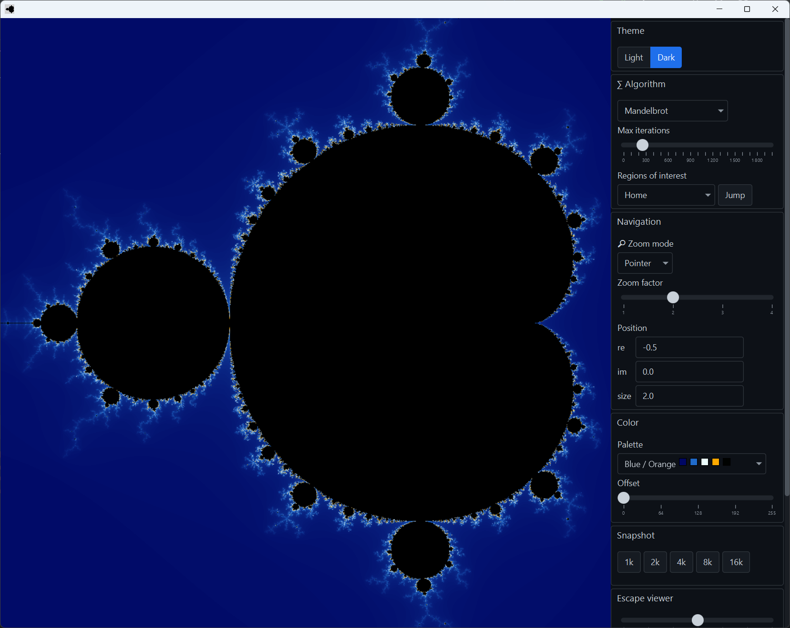
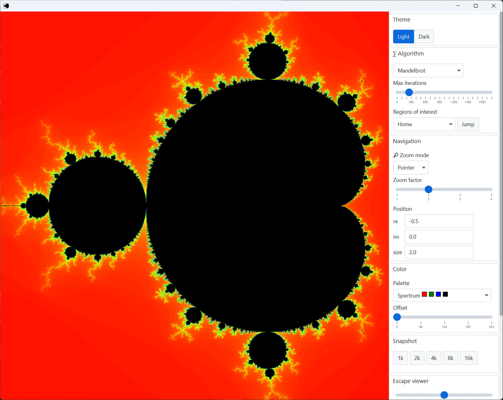
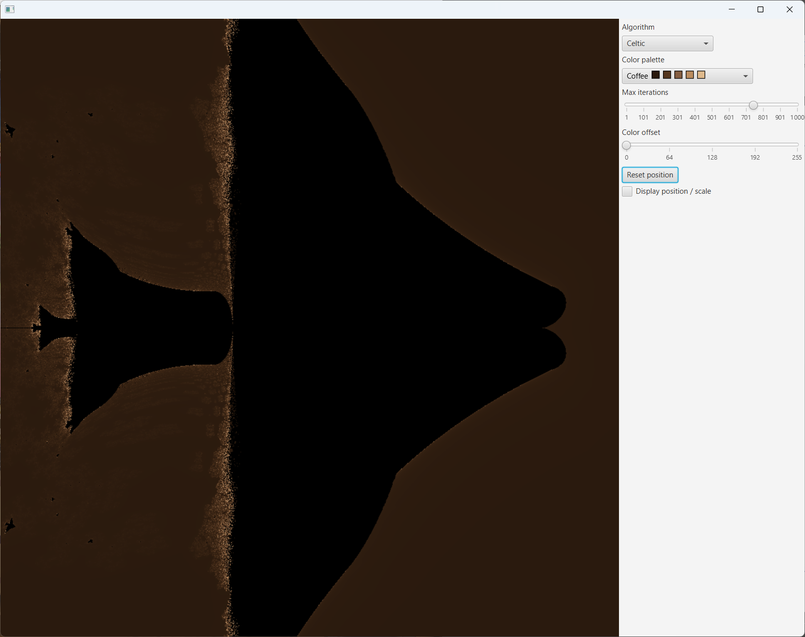
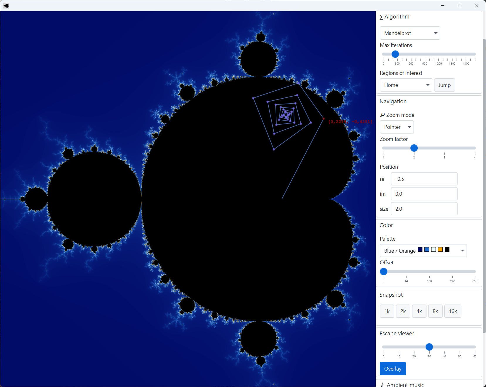
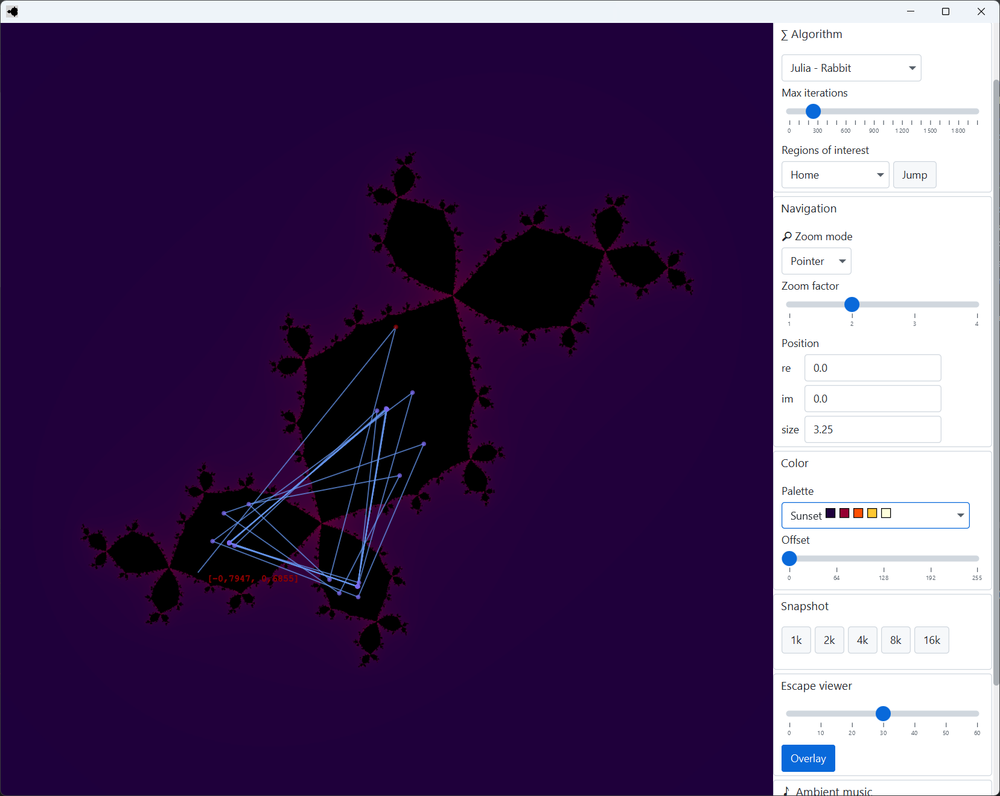

# Mandelbrot / Julia Set / ... explorer

* Left click : move to pointed position
* Mouse wheel : Zoom in / out (zooming can be performed relative to cursor position or current area's center)

## Algorithms

Multiple fractal algorithms are available :

* Mandelbrot
* Julia sets
* Burning ship
* Tricorn
* Celtic
* Newton Sine
* ...

## Startup

Run the command

```
mvn javafx:run
```

## Gallery








## Escape viewer

It is possible to enable the "escape" overlay.
When enabled, it shows the first iteration points on the complex plane, starting from the cursor's position.




## Shortcuts

Some keyboard shortcuts are available :

* <kbd>Alt</kbd> + <kbd>J</kbd> : Jump to selected location (from dropdown list)
* <kbd>Alt</kbd> + <kbd>O</kbd> : Enable / disable escape overlay
* <kbd>Alt</kbd> + <kbd>P</kbd> : Play / pause music

## Music

Free of use, by Clavier-Music

https://pixabay.com/users/clavier-music-16027823/
